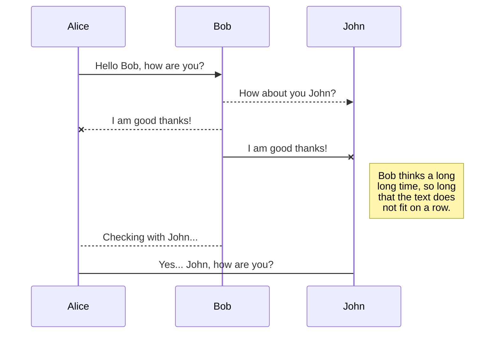
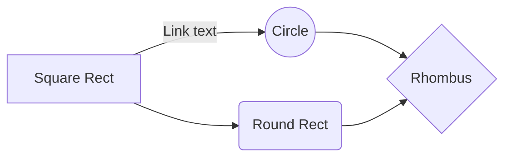

# Liquid Level Detector (Dynamic)		

This project was developed by [me](https://au.linkedin.com/in/sep-kimiaei-b007211b1)  in the hopes of being able to use Computer Vision via OpenCV in a way that would be able to  **not only** determine water levels on a pre-recorded video but to also measure the water level on a live video feed. 

## Prerequisites (Python)
- cv2
- math
- argparse
- imutils
- collections

## Recent Version Edits <i>3.21</i>

<li>Added new Gaussian Blur Values
<li>Restricted Inital Video Frame Size Scope

## Contributions 
[https://github.com/iftheqhar/opencv2_python](https://github.com/iftheqhar/opencv2_python)
[https://github.com/sashagaz/Hand_Detection](https://github.com/sashagaz/Hand_Detection)
[https://github.com/iftheqhar/OpenCV2-Python](https://github.com/iftheqhar/OpenCV2-Python)
[https://www.geeksforgeeks.org/multiple-color-detection-in-real-time-using-python-opencv/](https://www.geeksforgeeks.org/multiple-color-detection-in-real-time-using-python-opencv/)
[https://www.pyimagesearch.com/2015/09/14/ball-tracking-with-opencv/](https://www.pyimagesearch.com/2015/09/14/ball-tracking-with-opencv/)
[https://www.pyimagesearch.com/2018/07/30/opencv-object-tracking/](https://www.pyimagesearch.com/2018/07/30/opencv-object-tracking/)

# Methodology

I practiced detecting liquid (especially transparent ones such as water) using a wide variety of avenues. This resulted in a series of vastly differing performance reports and findings. These methods included **Colour Tracking**, **Frame Change Detection**, **Gaussian Blur**, **Canny Edge Detection** and a combination of all.

## Colour Tracking (with range)

This method  involved specifying a range of values that openCV would then start tracking. This method is a commonly used one within the scope of openCV methodologies.

## Frame Change Detection	

You can save any file of the workspace to **Google Drive**, **Dropbox** or **GitHub** by opening the **Synchronize** sub-menu and clicking **Save on**. Even if a file in the workspace is already synced, you can save it to another location. StackEdit can sync one file with multiple locations and accounts.

## Synchronize a file

Once your file is linked to a synchronized location, StackEdit will periodically synchronize it by downloading/uploading any modification. A merge will be performed if necessary and conflicts will be resolved.

If you just have modified your file and you want to force syncing, click the **Synchronize now** button in the navigation bar.

> **Note:** The **Synchronize now** button is disabled if you have no file to synchronize.

## Manage file synchronization

Since one file can be synced with multiple locations, you can list and manage synchronized locations by clicking **File synchronization** in the **Synchronize** sub-menu. This allows you to list and remove synchronized locations that are linked to your file.

# Publication

Publishing in StackEdit makes it simple for you to publish online your files. Once you're happy with a file, you can publish it to different hosting platforms like **Blogger**, **Dropbox**, **Gist**, **GitHub**, **Google Drive**, **WordPress** and **Zendesk**. With [Handlebars templates](http://handlebarsjs.com/), you have full control over what you export.

> Before starting to publish, you must link an account in the **Publish** sub-menu.

## Publish a File

You can publish your file by opening the **Publish** sub-menu and by clicking **Publish to**. For some locations, you can choose between the following formats:

- Markdown: publish the Markdown text on a website that can interpret it (**GitHub** for instance),
- HTML: publish the file converted to HTML via a Handlebars template (on a blog for example).

## Update a publication

After publishing, StackEdit keeps your file linked to that publication which makes it easy for you to re-publish it. Once you have modified your file and you want to update your publication, click on the **Publish now** button in the navigation bar.

> **Note:** The **Publish now** button is disabled if your file has not been published yet.

## Manage file publication

Since one file can be published to multiple locations, you can list and manage publish locations by clicking **File publication** in the **Publish** sub-menu. This allows you to list and remove publication locations that are linked to your file.

## SmartyPants

SmartyPants converts ASCII punctuation characters into "smart" typographic punctuation HTML entities. For example:

|                |ASCII                          |HTML                         |
|----------------|-------------------------------|-----------------------------|
|Single backticks|`'Isn't this fun?'`            |'Isn't this fun?'            |
|Quotes          |`"Isn't this fun?"`            |"Isn't this fun?"            |
|Dashes          |`-- is en-dash, --- is em-dash`|-- is en-dash, --- is em-dash|

## KaTeX

You can render LaTeX mathematical expressions using [KaTeX](https://khan.github.io/KaTeX/):

The *Gamma function* satisfying $\Gamma(n) = (n-1)!\quad\forall n\in\mathbb N$ is via the Euler integral

$$
\Gamma(z) = \int_0^\infty t^{z-1}e^{-t}dt\,.
$$

> You can find more information about **LaTeX** mathematical expressions [here](http://meta.math.stackexchange.com/questions/5020/mathjax-basic-tutorial-and-quick-reference).

## UML diagrams

You can render UML diagrams using [Mermaid](https://mermaidjs.github.io/). For example, this will produce a sequence diagram:

And this will produce a flow chart:

